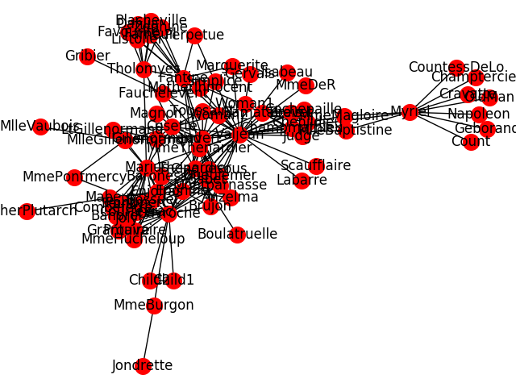
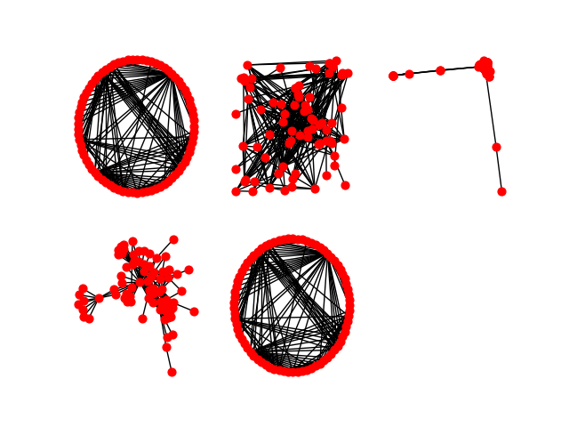
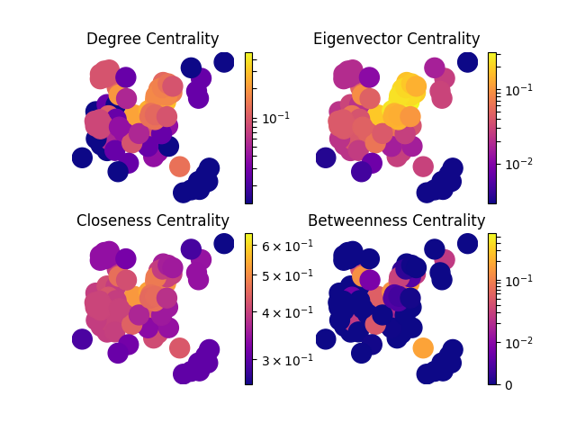

# networkx

- [install](#install)
- [import](#import)
- [How To use](#how-to-use)
    - [Express between nodes with edges](#express-between-nodes-with-edges)
    - [Visualization gmlFile](#visualization-gmlfile)

## install
```sh
pip install networkx
```

## import
```Python
import networkx as nx
```

## How To use

### Express between nodes with edges

```python
import networkx as nx

G = nx.Graph()  # 新規グラフを作成

G.add_node("A")                 # ノードを追加
print(nx.number_of_nodes(G))    #ノード数を出力
# 1

# リストも追加可能
G.add_nodes_from(["A", "B", "C", "D", "E"])    # A~Z の大文字を追加
print(nx.number_of_nodes(G))
# 5

G.add_edge("A", "B")            # エッジを追加
print(nx.number_of_edges(G))    # エッジ数を出力
# 1

#リストも追加可能
list_edge = [("C","D"), ("E", "F"), ("G", "H")]
G.add_edges_from(list_edge)
print(nx.number_of_edges(G))
# 4
```

### Visualization gmlFile
#### 1

```Python
import networkx as nx
import matplotlib.pyplot as plt

G = nx.read_gml("./lesmis/lesmis.gml")  # 相対ファイルパス
nx.draw(G, node_size=200, node_color='red', with_labels=True)
plt.savefig("visualization_1.png")   # pngファイルとして保存
```


#### 2

どのようなグラフを使用すべきか検討する
```Python
import networkx as nx
import matplotlib.pyplot as plt

G = nx.read_gml("./lesmis/lesmis.gml")

# 頂点を円周上に配置
plt.subplot(231)
nx.draw_circular(G, node_size=40, node_color='red', with_labels=False)

# 頂点をランダムに配置
plt.subplot(232)
nx.draw_random(G, node_size=40, node_color='red', with_labels=False)

# ネットワークを表す行列の固有ベクトルにより頂点を配置
plt.subplot(233)
nx.draw_spectral(G, node_size=40, node_color='red', with_labels=False)

# 頂点を力学モデルにより配置
plt.subplot(234)
nx.draw_spring(G, node_size=40, node_color='red', with_labels=False)

# 頂点を同心円状に配置
plt.subplot(235)
nx.draw_shell(G, node_size=40, node_color='red', with_labels=False)

plt.savefig("visualization_2.png")
```



#### 3

```Python
import networkx as nx
import matplotlib.pyplot as plt
import matplotlib.colors as mcolors
import numpy as np
import numpy.linalg as LA
from pprint import pprint

def main():
    G = nx.read_gml("./lesmis/lesmis.gml")
    pos = nx.spring_layout(G)

    plt.subplot(221)
    draw_h(G, pos, nx.degree_centrality(G), 'Degree Centrality')

    plt.subplot(222)
    draw_h(G, pos, nx.eigenvector_centrality(G), 'Eigenvector Centrality')

    plt.subplot(223)
    draw_h(G, pos, nx.closeness_centrality(G), 'Closeness Centrality')

    plt.subplot(224)
    draw_h(G, pos, nx.betweenness_centrality(G), 'Betweenness Centrality')

    plt.savefig("lesmis.png")


def draw_h(G, pos, measures, measure_name):
    nodes = nx.draw_networkx_nodes(G,
                                  pos,
                                  node_size=250,
                                  cmap=plt.cm.plasma,
                                  node_color=list(measures.values()),
                                  nodelist=list(measures.keys()))
    nodes.set_norm(mcolors.SymLogNorm(linthresh=0.01, linscale=1))
    plt.title(measure_name)
    plt.colorbar(nodes)
    plt.axis('off')


if __name__ == '__main__':
    main()
```

